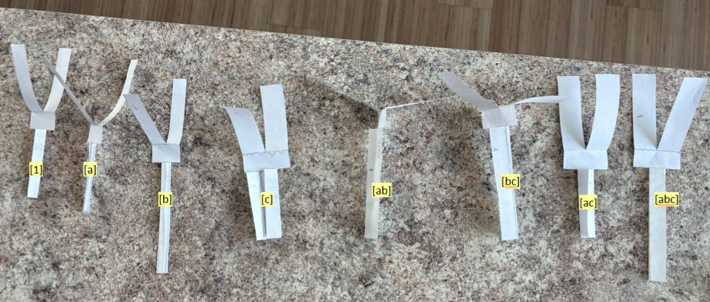
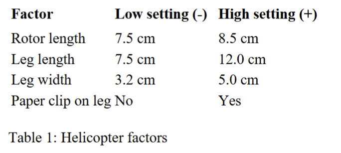

---
output:
  pdf_document: default
  html_document: default
---

# STA322 Project 1
## Abby Li and Austin Huang

```{r}
helicopter <- read.csv("project2-finaldata.csv")

# check that the data is consistent with averages calculated on sheets
mean_check <- aggregate(flight_time ~ trt, data = helicopter, FUN = mean)
```

### Description of Study Design

{width=60%}

{width=60%}

### Questions:
### Which factors seem to be most important for making helicopters that fly longer?

```{r}

```

### Is there any evidence that the effect of rotor length differs by leg width?

```{r}

```


### What would you recommend as the ideal combination to make the helicopter fly long?

```{r}

```

